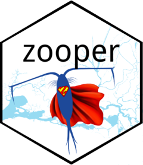
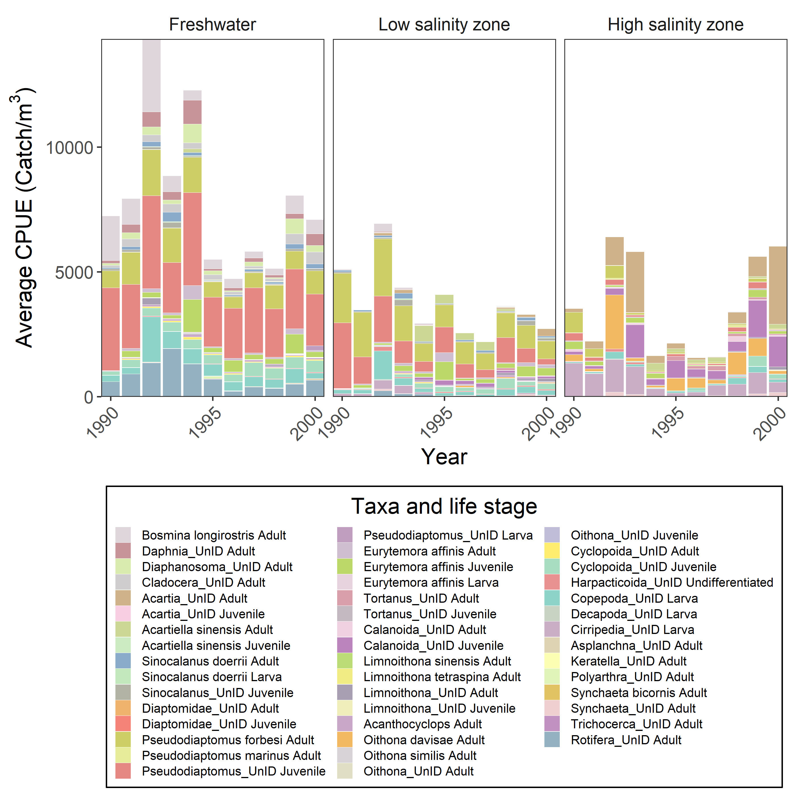

# zooper 

<!-- badges: start -->

[](https://github.com/InteragencyEcologicalProgram/zooper/actions)
[](https://codecov.io/gh/InteragencyEcologicalProgram/zooper?branch=master)
[](https://doi.org/10.5281/zenodo.5828619)
[](https://portal.edirepository.org/nis/mapbrowse?scope=edi&identifier=539)
<!-- badges: end -->

An R package to download and integrate zooplankton data from the
Sacramento San Joaquin Delta.

## Installation

You can install the development version from GitHub with:

``` r
# install.packages("devtools")
devtools::install_github("InteragencyEcologicalProgram/zooper")
```

# Introduction

This package has 2 main functions and a few accessory functions. The
`Zoopdownloader` function downloads the zooplankton datasets from their
respective online sources and converts them to a consistent format. The
`Zoopsynther` function takes zooplankton data from different surveys and
integrates the data according to user-specified parameter choices.

This package is also accessible through a [shiny
app](https://deltascience.shinyapps.io/zoopsynth) [(code and
installation instructions for latest version available
here)](https://github.com/InteragencyEcologicalProgram/ZoopSynth). The
app is a GUI (graphical user interface) that allows users without R
experience to run the zooplankton synthesizer function and download the
resulting data. The shiny app also allows users with all experience
levels to easily visualize the data.

## Community or taxon-specific analyses?

The biggest problem with integrating zooplankton datasets is variability
in taxonomic resolution. To resolve this, we have developed 2 approaches
to consolidating inconsistent data to “least common denominator taxa.”
Depending on what type of analysis you wish to run, you may wish for
different types of synthesized data.

### For community data analyzers

*I want to analyze the community composition at whatever taxonomic level
lets me use all these datasets.*

-   Consistent taxonomic categories
-   No plankters counted more than once
-   Sacrifices some taxonomic resolution
-   Removes taxa with no relatives in all datasets (e.g., Annelida)

### For specific taxa analyzers

*I want all possible data on these specific taxa.*

-   Calculates total CPUE for higher taxonomic levels
-   Some plankters appear in multiple nested taxa (e.g., Calanoida,
    Copepoda)
-   Preserves taxonomic resolution and creates taxonomic categories that
    are comparable across all datasets
-   Labels taxa that are comparable across all datasets, warns about
    those that are not.

## Size classes

We have integrated zooplankton data from 3 net size classes:

1.  Macro (500-505 μm): Amphipods and mysids (NOTE: Prior to 1974 EMP
    macrozooplankton were sampled with a 930 μm mesh net)
2.  Meso (150 - 160 μm): Copepods, cladocera
3.  Micro (43 μm): Copepods, rotifers

Nets accurately sample zooplankton larger than the mesh size.
Zooplankton smaller than the mesh size are still captured and often
recorded in datasets, but the resulting CPUEs are not accurate. To
account for this we:

1.  Resolve taxonomic resolution separately within each net size class.
2.  If `Data = 'Taxa'`, we mark “summed groups” with the net size class
    from which they were derived.
3.  All potentially undersampled data are marked with a flag
    `Undersampled == TRUE`
4.  For the plots in the shiny app, all data with `Undersampled == TRUE`
    can be removed. However, data downloaded from the app do contain
    undersampled data.

## Changing taxonomic resolution over time

For many studies, taxonomic resolution has changed over time. This could
confound analyses of zooplankton communities and abundances over time.
To account for this, we have implemented a solution for the
`Data_type="Community"` option, which can be implemented by setting
`Time_consistency = TRUE`.

We first find all taxa that were not counted every year across the date
range the user inputs (but taking into account the years non-native
species were introduced and each survey first started sampling). These
taxa are then summed to higher taxonomic levels, as is done for taxa
that were not counted across all datasets.

Often, non-native species are not added to zooplankton species list the
same year they are first detected in the system. To allow for some lag
between introduction years and the years these species were first
counted, you can change the `Intro_lag` option (currently defaults to 2
years).

# Usage

``` r
library(zooper)
MyZoops <- Zoopsynther(Data_type = "Community", 
                       Sources = c("EMP", "FRP", "FMWT"), 
                       Size_class = "Meso", 
                       Date_range = c("1990-10-01", "2000-09-30"))
#> [1] "No disclaimers here! Enjoy the clean data!"

str(MyZoops)
#> tibble [151,478 x 33] (S3: tbl_df/tbl/data.frame)
#>  $ Source      : chr [1:151478] "EMP" "EMP" "EMP" "EMP" ...
#>  $ SizeClass   : chr [1:151478] "Meso" "Meso" "Meso" "Meso" ...
#>  $ Volume      : num [1:151478] 10.6 10.6 10.6 10.6 10.6 ...
#>  $ Lifestage   : chr [1:151478] "Adult" "Adult" "Adult" "Adult" ...
#>  $ Taxname     : chr [1:151478] "Acanthocyclops" "Acartia_UnID" "Acartiella sinensis" "Asplanchna_UnID" ...
#>  $ Phylum      : chr [1:151478] "Arthropoda" "Arthropoda" "Arthropoda" "Rotifera" ...
#>  $ Class       : chr [1:151478] "Copepoda" "Copepoda" "Copepoda" "Eurotatoria" ...
#>  $ Order       : chr [1:151478] "Cyclopoida" "Calanoida" "Calanoida" "Ploima" ...
#>  $ Family      : chr [1:151478] "Cyclopidae" "Acartiidae" "Acartiidae" "Asplanchnidae" ...
#>  $ Genus       : chr [1:151478] "Acanthocyclops" "Acartia" "Acartiella" "Asplanchna" ...
#>  $ Species     : chr [1:151478] NA NA "Acartiella sinensis" NA ...
#>  $ Taxlifestage: chr [1:151478] "Acanthocyclops Adult" "Acartia_UnID Adult" "Acartiella sinensis Adult" "Asplanchna_UnID Adult" ...
#>  $ SampleID    : chr [1:151478] "EMP NZEZ2 1994-03-21" "EMP NZEZ2 1994-03-21" "EMP NZEZ2 1994-03-21" "EMP NZEZ2 1994-03-21" ...
#>  $ CPUE        : num [1:151478] 11.34 1.89 5.67 0 0 ...
#>  $ Undersampled: logi [1:151478] FALSE FALSE FALSE TRUE FALSE FALSE ...
#>  $ Date        : POSIXct[1:151478], format: "1994-03-21" "1994-03-21" ...
#>  $ Station     : chr [1:151478] "NZEZ2" "NZEZ2" "NZEZ2" "NZEZ2" ...
#>  $ Chl         : num [1:151478] NA NA NA NA NA NA NA NA NA NA ...
#>  $ Secchi      : num [1:151478] 35 35 35 35 35 35 35 35 35 35 ...
#>  $ Temperature : num [1:151478] 14.8 14.8 14.8 14.8 14.8 14.8 14.8 14.8 14.8 14.8 ...
#>  $ BottomDepth : num [1:151478] NA NA NA NA NA NA NA NA NA NA ...
#>  $ Tide        : chr [1:151478] "High slack" "High slack" "High slack" "High slack" ...
#>  $ Year        : num [1:151478] 1994 1994 1994 1994 1994 ...
#>  $ Datetime    : POSIXct[1:151478], format: "1994-03-21 09:25:00" "1994-03-21 09:25:00" ...
#>  $ Turbidity   : num [1:151478] NA NA NA NA NA NA NA NA NA NA ...
#>  $ Microcystis : chr [1:151478] NA NA NA NA ...
#>  $ pH          : num [1:151478] NA NA NA NA NA NA NA NA NA NA ...
#>  $ DO          : num [1:151478] NA NA NA NA NA NA NA NA NA NA ...
#>  $ AmphipodCode: chr [1:151478] NA NA NA NA ...
#>  $ SalSurf     : num [1:151478] 0.644 0.644 0.644 0.644 0.644 ...
#>  $ SalBott     : num [1:151478] 0.958 0.958 0.958 0.958 0.958 ...
#>  $ Latitude    : num [1:151478] NA NA NA NA NA NA NA NA NA NA ...
#>  $ Longitude   : num [1:151478] NA NA NA NA NA NA NA NA NA NA ...
```

Here’s a graph you could make with the data

``` r
library(dplyr)
library(ggplot2)
library(RColorBrewer)
set.seed(16)

MyZoops%>%
  filter(!is.na(SalSurf))%>%
  mutate(Salinity_zone=case_when(
    SalSurf < 0.5 ~ "Freshwater",
    SalSurf > 0.5 & SalSurf < 6 ~ "Low salinity zone",
    SalSurf > 6 ~ "High salinity zone"
  ))%>%
  mutate(Salinity_zone=factor(Salinity_zone, levels=c("Freshwater", "Low salinity zone", "High salinity zone")))%>%
  group_by(Year,Phylum, Class, Order, Family, Genus, Species, Lifestage, Taxlifestage, Salinity_zone)%>%
  summarise(CPUE=mean(CPUE, na.rm=T))%>%
  ungroup()%>%
  arrange(Phylum, Class, Order, Family, Genus, Species, Lifestage)%>%
  mutate(Taxlifestage=factor(Taxlifestage, unique(Taxlifestage)))%>%
  ggplot(aes(x=Year, y=CPUE))+
  geom_bar(stat="identity", color="white", size=0.01, aes(fill=Taxlifestage))+
  facet_wrap(~Salinity_zone, nrow=1)+
  coord_cartesian(expand=0)+
  scale_x_continuous(breaks = function(x) unique(floor(pretty(seq(min(x), max(x)), n=3))), expand=c(0,0))+
  scale_fill_manual(values=sample(colorRampPalette(brewer.pal(12, "Set3"))(length(unique(MyZoops$Taxlifestage)))), 
                    name="Taxa and life stage", 
                    guide = guide_legend(ncol=3, title.position = "top", title.hjust = 0.5))+
  ylab(bquote(Average~CPUE~"("*Catch*"/"*m^3*")"))+
  theme_bw()+
  theme(panel.grid=element_blank(), text=element_text(size=14), legend.text = element_text(size=8), 
        legend.key.size = unit(10, "points"), strip.background=element_blank(), legend.position = "bottom", 
        legend.background = element_rect(color="black"), axis.text.x=element_text(angle=45, hjust=1))
```



# Code of conduct

Please note that the ‘zooper’ project is released with a [Contributor
Code of Conduct](CODE_OF_CONDUCT.md). By contributing to this project,
you agree to abide by its terms.
